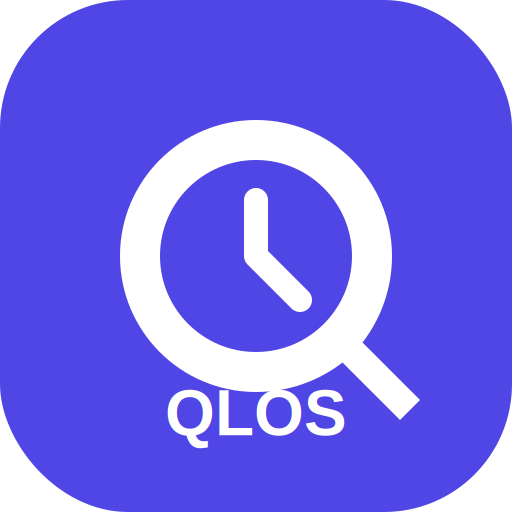

# QuizLOS v.1.0 🚀

<div align="center">
  
  <h3>Secure • Professional • Offline-First</h3>
  <p><b>A modern examination platform for high-integrity testing.</b></p>
</div>

---

## 🌟 Overview

**QuizLOS** is a premium, secure, and offline-first quiz platform designed for schools and organizations that require high-integrity examinations. It consists of:
- **Admin Dashboard**: A robust Laravel 11 backend for real-time monitoring and quiz management.
- **Participant App**: A sleek React Native (Expo) mobile application with built-in anti-cheat technology.

---

## 🛠 Tech Stack

### 🖥️ Backend (Laravel 11)
- **Engine**: PHP 8.2+ & Laravel 11.
- **Security**: Laravel Sanctum for API Auth & Rate Limiting.
- **Monitoring**: Custom Live Activity Log with Asia/Makassar (WITA) precision.
- **UI/UX**: Indigo Premium Theme, DataTables integration, Responsive Design.

### 📱 Mobile (React Native Expo)
- **Engine**: Expo SDK 51+ (Modular Architecture).
- **Security**: Background Detection (Anti-Cheat), `expo-navigation-bar` System Lock.
- **Database**: `expo-sqlite` for offline-first data integrity.
- **Styling**: Unified QLOS Branding with smooth micro-animations.

---

## 🔐 Key Features

- **🛡️ Anti-Cheat Enforcement**: Automatic disqualification if the participant exits the app or enters background mode.
- **📊 Real-time Activity Monitor**: Admins see exactly when a participant starts, answers, or changes their response.
- **🌐 Offline-First Sync**: Take quizzes without constant internet; progress is saved locally and synced automatically when online.
- **⚡ Performance Tables**: Advanced search, sort, and pagination for large participant datasets.
- **🕒 WITA Sync**: All logs are synchronized to Asia/Makassar (WITA) time for accurate examination auditing.

---

## 🚀 Installation & Setup

### 1. Admin Server (Laravel)
```bash
cd laravel-server
composer install
npm install
# Configure your .env (DB, App URL)
php artisan migrate:fresh --seed
php artisan serve --host=0.0.0.0
```

### 2. Participant App (Mobile)
```bash
cd mobile
npm install
# Update API_URL in src/theme/constants.js
npx expo start
```

---

## 📂 Project Structure
```text
.
├── laravel-server/   # Backend, Admin Panel, and API
├── mobile/           # React Native Participant Application
└── README.md         # Main project documentation
```

---

## 📄 License
This project is for internal development and examination purposes.

**QuizLOS v.1.0 • Built for Integrity**
